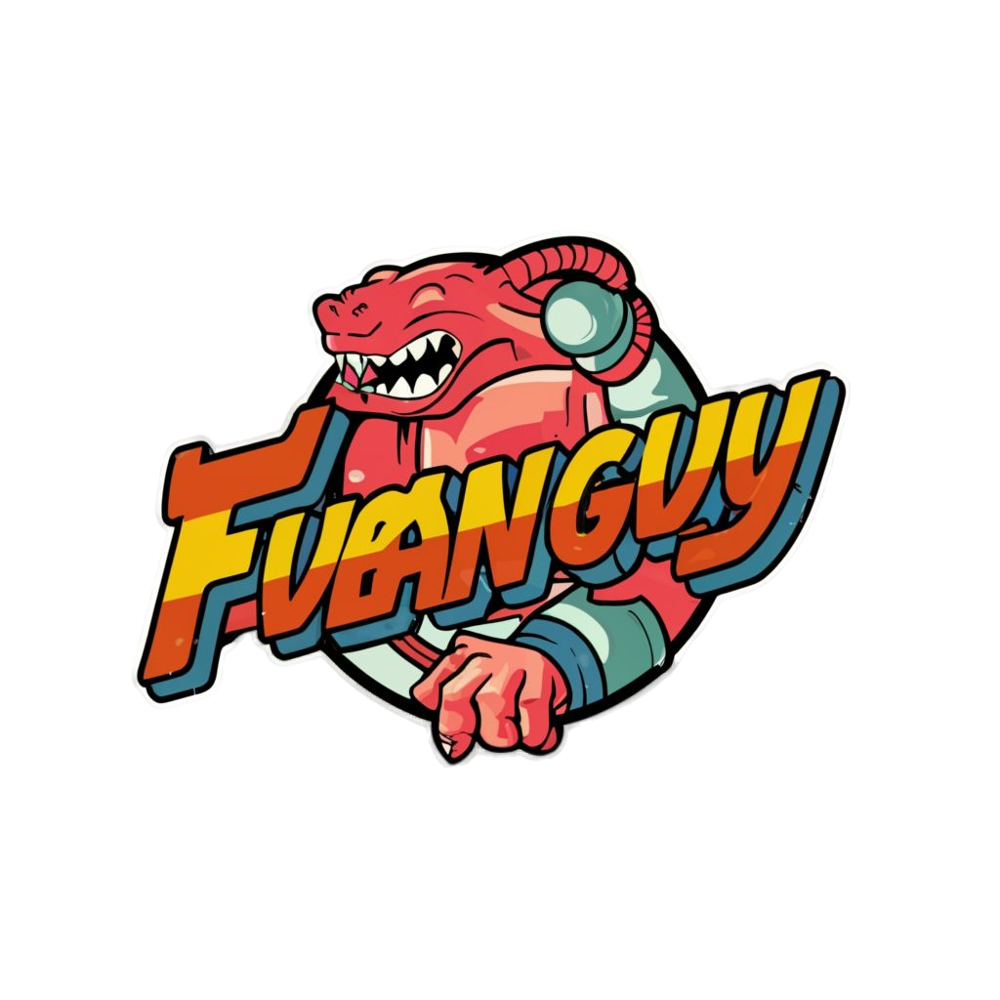

<h1 align="center">Fubanguy - The Game</h1>

<p align="center">
  
  <br>
  <em>Fubanguy! Esse game é fuminante cara! Personagens muito locos, só as lendas!

Imagina só, você controlando o Tiringa, Maike da SWAT,  Ninja e muito mais! Cada personagem tem suas manhas e golpes especiais que vão fazer você dar muita risada e se surpreender.

Os cenários são insanos também, meu parceiro! Você vai lutar no "Bar", na "Favela" e até no "QGs". É espetaculoso!

Nesse game você pode jogar de 2 kkkk, então chama seu parceiro e prepare-se para dar muita risada.

Fubanguy reune toda a zoeira e insanidade BR direto pro mundo dos games. Vlw meu parceiro! É nóis!
  <br>
</p>


### Local Development

To contribute to Angular docs, you can setup a local environment with the following commands:

```bash
# Clone Fubanguy repo
git clone https://github.com/yamacinelli/fubanguy.git

# Navigate to project directory
cd fubanguy
```

## Development Setup

3. Create and activate the virtual environment:

```bash
python3 -m venv venv
```
* Linux
```bash
source venv/bin/activate
```
* Windows
* ```open powershell with administrator privileges```

```powershell
Set-ExecutionPolicy AllSigned
```
* ```Activate```
```powershell
.\.venv\Scripts\Activate.ps1
```

4. Install dependencies:

```bash
pip install -r requirements.txt
```

## Settings for vscode


Download and import the profile containing the extensions into vscode, [Extentions](https://drive.google.com/file/d/1FIF-ZdqTT4A0Ocv8bIXZG7sMWGT3OkfF/view)

* ```settings.json```
```json
{
    "files.autoSave": "afterDelay",
    "python.defaultInterpreterPath": "${workspaceFolder}/.venv/bin/python3",
    "python.autoComplete.extraPaths": ["${workspaceFolder}/src"],
    "python.envFile": "${workspaceFolder}/.env",
    "python.analysis.extraPaths": ["${workspaceFolder}/src"],
}
```

* ```launch.json```
```json
{
    "version": "0.2.0",
    "configurations": [
        {
            "name": "Python Debugger: main.py",
            "type": "debugpy",
            "request": "launch",
            "program": "${workspaceFolder}/main.py",
            "console": "integratedTerminal",
        },
    ]
}
```

## Project structure

```plaintext
fubanguy/
│
├── src/
│   ├── main.py                         # Entrada principal do sistema
│   ├── domain/
│   │   └── entities/
│   │       ├── fighter.py              # Entidade Fighter
│   │       └── stage.py                # Entidade Stage
│   ├── core/
│   │   ├── value_object/
│   │   │   └── transform.py            # Objetos de Valor
│   │   └── interfaces/                 # Diretório para Portas (Interfaces)
│   │       ├── display_interface.py    # Interface para Display (Output Port)
│   │       ├── controls_interface.py   # Interface para Controls (Input Port)
│   │       └── music_interface.py      # Interface para Music (Output Port)
│   ├── application/
│   │   └── use_cases/
│   │       ├── fight_use_case.py      # Caso de Uso para lutas
│   │       └── game_engine.py         # Motor do jogo que gerencia o loop principal
│   └── infra/
│       └── frameworks/
│           └── py_game/
│               ├── pygame_controls.py # Adaptador para Controls usando Pygame
│               ├── pygame_display.py  # Adaptador para Display usando Pygame
│               └── pygame_music.py    # Adaptador para Music usando Pygame
└── README.md
```

**Love Fubanguy? Give our repo a star :star: :arrow_up:.**

Made with :blue_heart: by MÁRCIO :wave: [See my LinkedIn](https://www.linkedin.com/in/marciojcarvalho/) and YAGO :wave: [See my LinkedIn](https://www.linkedin.com/in/yago-macinelli-569560140?utm_source=share&utm_campaign=share_via&utm_content=profile&utm_medium=android_app)
