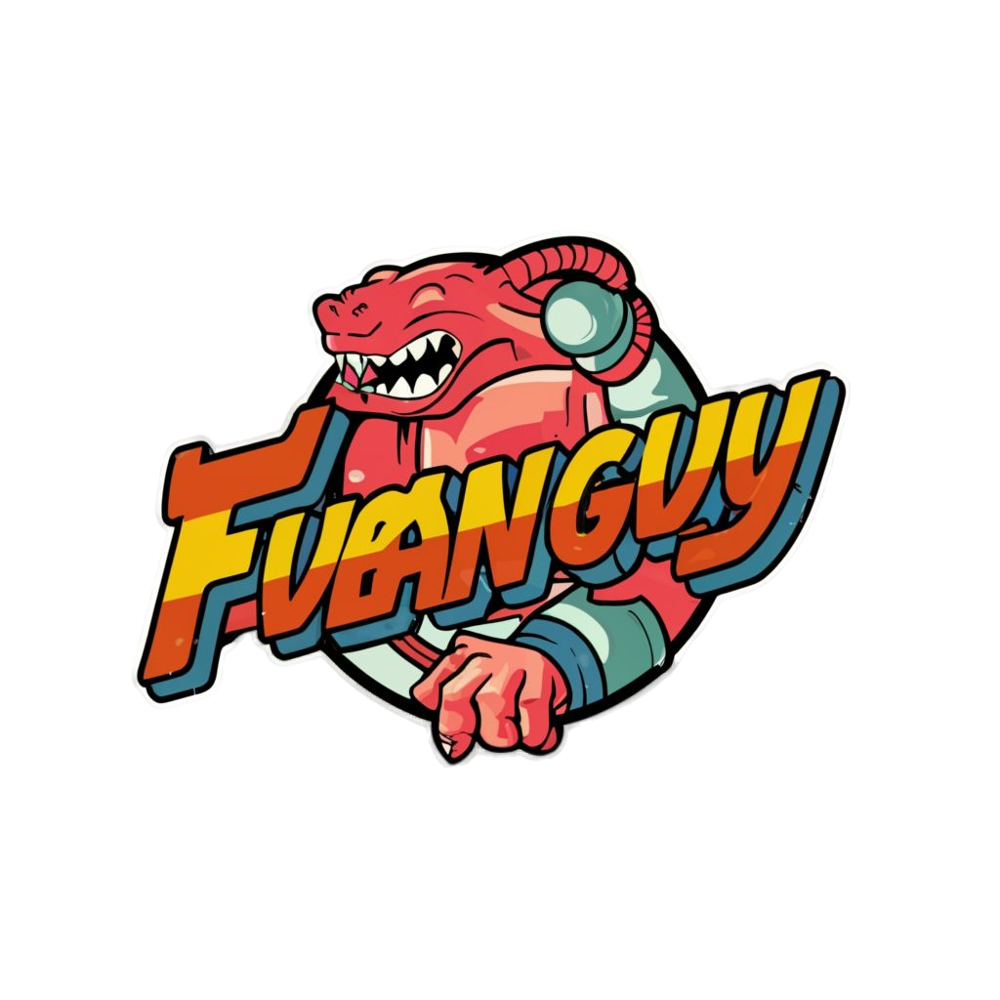

<h1 align="center">Fubanguy - The Game</h1>

<p align="center">
  
  <br>
  <em>The objective of this project is to create a video game. A challenge proposed by the Instituto Federal do Paraná (IFPR) campus Paranavaí - PR.
  <br>
</p>

<h4 align="center">
    :construction: README :rocket: Under construction... :construction:
</h4>

### Local Development

To contribute to Angular docs, you can setup a local environment with the following commands:

```bash
# Clone Fubanguy repo
git clone https://github.com/yamacinelli/fubanguy.git

# Navigate to project directory
cd fubanguy
```

## Development Setup

3. Create and activate the virtual environment:

```bash
python3 -m venv venv
```
* Linux
```bash
source venv/bin/activate
```
* Windows
<br>
 ```open powershell with administrator privileges```

```powershell
Set-ExecutionPolicy AllSigned
```
* ```Activate```
```powershell
.\.venv\Scripts\Activate.ps1
```

4. Install dependencies:

```bash
pip install -r requirements.txt
```

## Settings for vscode


Download and import the profile containing the extensions into vscode, [Extentions](https://drive.google.com/file/d/1FIF-ZdqTT4A0Ocv8bIXZG7sMWGT3OkfF/view)

* ```settings.json```
```json
{
    "files.autoSave": "afterDelay",
    "python.defaultInterpreterPath": "${workspaceFolder}.venv/bin/python3",

    "[python]": {
        "editor.formatOnSave": true,
        "editor.formatOnPaste": true,
        "editor.defaultFormatter": "ms-python.black-formatter"
    }
}
```

* ```launch.json```
```json
{
    "version": "0.2.0",
    "configurations": [
        {
            "name": "Python Debugger: main.py",
            "type": "debugpy",
            "request": "launch",
            "program": "${workspaceFolder}/main.py",
            "console": "integratedTerminal",
        },
    ]
}
```

## Project structure

```plaintext
fubanguy/
│
├── assets/
│   ├── imagens/
│   │   ├── jogador.png
│   │   ├── inimigo.png
│   │   ├── fundo.png
│   │   └── ...
│   ├── sons/
│   │   ├── trilha_sonora.mp3
│   │   ├── efeito_sonoro1.wav
│   │   └── ...
│   └── fontes/
│       ├── fonte1.ttf
│       ├── fonte2.ttf
│       └── ...
│
├── src/
│   ├── domain/
│   │   ├── jogador.py
│   │   ├── inimigo.py
│   │   ├── mapa.py
│   │   └── ...
│   │
│   ├── usecases/
│   │   ├── mover_jogador.py
│   │   ├── criar_inimigo.py
│   │   ├── verificar_colisao.py
│   │   └── ...
│   │
│   ├── adapters/
│   │   ├── pygame_adapter.py
│   │   ├── input_adapter.py
│   │   ├── output_adapter.py
│   │   └── ...
│   │
│   ├── interface_usuario/
│   │   ├── tela.py
│   │   ├── menu.py
│   │   └── ...
│   │
│   ├── main.py
│   └── config.py
│
└── README.md
```

**Love Fubanguy? Give our repo a star :star: :arrow_up:.**

Made with :blue_heart: by MÁRCIO :wave: [See my LinkedIn](https://www.linkedin.com/in/marciojcarvalho/) and YAGO :wave: [See my LinkedIn](https://www.linkedin.com/in/yago-macinelli-569560140?utm_source=share&utm_campaign=share_via&utm_content=profile&utm_medium=android_app)